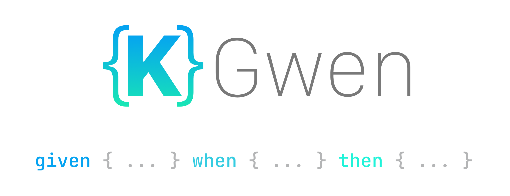

<p align="center">

</p>

KGwen is a minimal, type-safe DSL that allows you to write readable acceptance tests directly in
Kotlin code. Here's an example:
```kotlin
@Test
fun `New notifications appear on notification drawer`() {
    given {
        notificationService has { missedCall and newMessage and newEvent }
    } whenever {
        user opens { notificationDrawer }
    } then {
        user sees { missedCall and newMessage and newEvent }
    }
}
```

It is an alternative to frameworks such as Cucumber, optimized for Kotlin and thanks to it's 
annotation processor, requires minimal work to adopt on an existing test codebase.

# Quick Introduction

### Test Sections
KGwen provides three blocks associated with typical BDD style test sections:
```kotlin
    given { /* ... */ } whenever { /* ... */ } then { /* ... */ }
```
- `given`: to arrange test *preconditions* 
- `when(ever)`: to state behaviour (i.e. *actions*)
- `then`: to *assert* expected changes

### Block Syntax
The statement(s) provided in each test section follow the same basic syntactic structure:
```kotlin
subject verb { objects... }
```
- `subject`: an entity that can appear in one or more sections (e.g. a user, service, the OS)
- `verb`: a particle that provides context to `objects` 
- `objects`: the actual test preconditions, actions and assertions associated with a specific 
  `subject` and categorized by `verb` type.

# Adopting KGwen
To start using KGwen you need to:
1. Declare your test subjects
2. (Optionally) declare custom verbs
3. Create the objects that map to your existing preconditions, actions and assertions

KGWen provides an annotation system to easily perform these steps.

### Declaring Test Subjects
You can use the `@KGwenSubjet` annotation to create a new test subject:
```kotlin
@KGwenSubject
object User :
   ArrangerRole<User>,         // Arranger of test preconditions
   Selects<User>, Types<User>, // Action verbs, i.e. ActorRole
   Sees<User>, On<User>        // Assertion verbs, i.e. AsserterRole
```

This will generate a `UserUsage.kt` file with the code required to call `User` in each applicable
test section using the `user` keyword. Note that test subjects are type-safe which means you'll only 
be able to call them in a test section when they can actually appear. In the example above, `User` 
adopts *action* and *assertions* verbs (conforming to `ActorRole` and `AsserterRole`), so 
you'll be able to call `user` inside `whenever` and `then` blocks. If you also want to use a subject 
as a precondition arranger, simply conform to `AsserterRole`.

### Declaring Custom Verbs
Verbs describe the type (categories) of objects that follow (e.g. `selects` - click interactions, 
`sees` - visibility assertions). You can easily create new verbs for your own specific use cases 
using the `@KGwenVerb` annotation:
```kotlin
@KGwenVerb(inArrangerScope = true)
interface Has<T> : ActorRole<T> where T : Has<T>        // Action verb

@KGwenVerb(inArrangerScope = true)
interface Sees<T> : AsserterRole<T> where T : Sees<T>  // Assertion verb
```
First you declare a generic interface (so you may use the verb with multiple subjects) and then you 
specify whether it is an action or assertion verb by conforming to either `ActorRole` or 
`AsserterRole`, respectively. If you also want to use that verb with an arranger, you can set the 
`inArrangerScope = true` flag.

### Creating Objects
Objects are the bread and butter of KGwen as they represent the preconditions, actions and 
assertions you'll call on your test cases. You can use `@KGwenObject` to annotate the methods that 
implement the action/assertion logic and create new objects:
```kotlin
@KGwenObject(name = "email", subject = User::class, verb = Types::class)
fun Actions.typeEmail() { 
    /* your typing logic here */
}
```
You need to associate the object with a test `subject` and a `verb` and provide a `name`. Based on 
the example above, you can now call your e-mail typing logic using the newly created object:
```kotlin
user types { email }
```
KGwen requires the annotated methods to be parameterless. If some of your current methods do have 
arguments, you may convert them using context receivers (see KGwen and Compose).

# Additional Features

## Nodes
KGwen object may be treated as nodes you can perform operations on. These include, for example, 
chaining and transformations.

### Chaining 
Node chaining allows you to link objects using custom keywords:
```kotlin
whenever {
    user types { email and password }
}
```
In this example `and` is a keyword implemented by the `And` keyword interface. If you want to use 
a keyword with objects of a specific verb, simply conform that verb to the keyword interface:
```kotlin
@KGwenVerb
interface Types<T> : And, ActorRole<T> where T : Types<T>
```

### Custom Keywords
You can customize chaining with your own keywords using `@KGwenKeyword`. For example:
```kotlin
@KGwenKeyword
interface Then : NodeOperation
```
This will create a `ThenUsage.kt` file so you can use `then` as a keyword. Let's now add this 
keyword to objects of a `Selets` verb:
```kotlin
@KGwenVerb
interface Selects<T> : Then, ActorRole<T> where T : Then<T>
```
Now you may write something like:
```kotlin
whenever {
    user selects { optionA then optionB then optionC }
}
``` 

### Transformations
Transformations effectively change the behaviour of the objects they are applied to. Example: 
```kotlin
then {
    user sees {  no { notificationBadge } and markAsUnreadIcon }
}
```
`no` is a transformation implemented by the `Negatable` interface which may be applied to assertion 
objects to create a new assertion which is the logic negation of the original object. Here, 
`no { notificationBadge }` is a transformation of the `notificationBadge` assertion which negates
the visibility assertion for a notification badge. If this transformation fails (because the 
notification badge is actually visible), you'll get a readable assertion error based on the object 
name:
```
AssertionFailedError: NotificationBadge was asserted!
```

## Scope Functions
KGwen also provides subject scoping functions for reduced verbosity. This is useful when a test 
requires many short action-assertion statements that could be written as one liners. You'll have 
access to a `check` block which is a mixed section where you can chain multiple `whenever` and 
`then` blocks which implicitly receive an instance of the scoped subject so you can omit 
it:
```kotlin
given {
    user on { notifications }
    notificationService has { notification } 
} check with(User) {
    immediately { sees { notificationBadge and markAsReadIcon } }
    whenever { selects { markAs } } then { sees { no { notificationBadge } and markAsUnreadIcon } }
    whenever { selects { markAs } } then { sees { notificationBadge and markAsReadIcon } }
}
```
These `whenever` and `then` variants are still type-safe because the `User` instance they receive 
only exposes `User` as an *actor* and *asserter*, respectively. Also note that `with` can only be 
used with subjects that conform to **both** `ActorRole` and `AsserterRole`.

If the whole scenario uses a single test subject which is an *arranger*, *actor*, and *asserter*, 
you may scope it using `given` to greatly reduce verbosity:

```kotlin
given(User) {
    on { home }
} check {
    whenever { opens { drawer } } then { sees { homeHighlighted } }
    whenever { selects { messages } } then { on { messages } }
    whenever { opens { drawer } } then { sees { messagesHighlighted } }
    // ...
}
```
